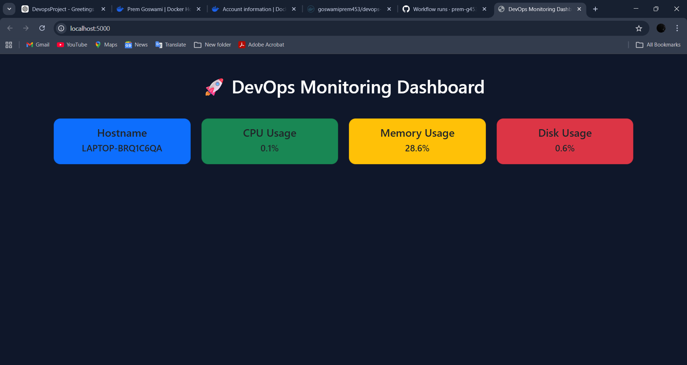

# 🚀 DevOps Monitoring Dashboard

A Flask-based system monitoring dashboard that displays real-time system metrics like CPU usage, memory usage, disk usage, and hostname.

This project demonstrates core DevOps practices including containerization, CI/CD automation, and cloud-ready deployment.

---

## 📌 Features

- 📊 Real-time system monitoring (CPU, Memory, Disk)
- 🖥️ Displays hostname and server stats
- 🎨 Clean UI with Bootstrap
- 🐳 Docker containerization
- ⚙️ CI/CD pipeline using GitHub Actions
- 📦 Automatic Docker image push to Docker Hub

---

## 🛠️ Tech Stack

- Python (Flask)
- psutil
- Docker
- GitHub Actions
- AWS EC2 (for deployment)

---

## 📂 Project Structure

devops-monitoring-dashboard
│
├── app.py
├── requirements.txt
├── Dockerfile
├── .dockerignore
├── README.md
│
├── templates/
│ └── index.html
│
└── .github/
└── workflows/
└── docker-build.yml

---

## ⚙️ How It Works

Developer pushes code → GitHub Actions triggers → Docker image builds → Image pushed to Docker Hub

---

## 🐳 Docker Setup

### Build Image

docker build -t devops-monitoring .

### Run Container

docker run -p 5000:5000 devops-monitoring

---

## ⚙️ CI/CD Pipeline

- Trigger: Push to `main` branch
- Steps:
  - Checkout code
  - Build Docker image
  - Push image to Docker Hub

---

## ☁️ Deployment (AWS EC2)

The application can be deployed on AWS EC2 using Docker:

docker pull yourusername/devops-monitoring-app
docker run -d -p 80:5000 yourusername/devops-monitoring-app

---

## 📸 Screenshot

---

## 💼 Learning Outcome

- Learned Docker containerization
- Implemented CI/CD using GitHub Actions
- Worked with environment secrets
- Built a real-world DevOps workflow

---

## 🔗 Author

Prembharti Goswami